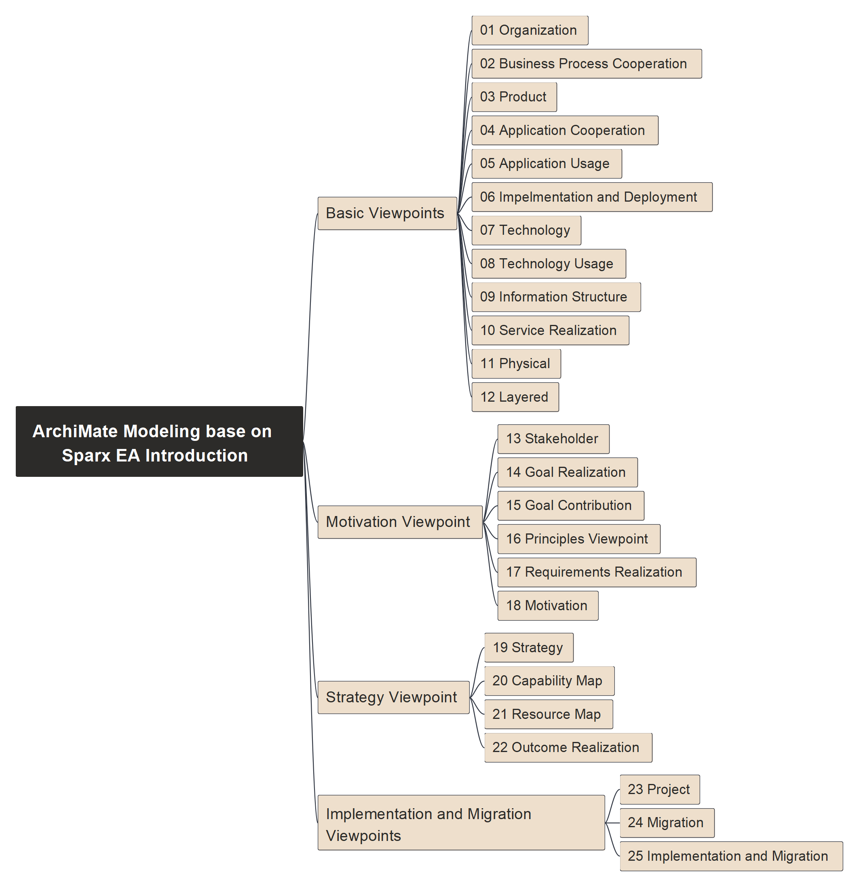

# ArchiMate Modeling base on SparxEA Intro

Sparx Systems EA (Enterprise Architec) tool is one modeling tool for architects building the repository and do collaboration, they publish one nice introduction on [ArchiMate Language and Practice](https://sparxsystems.com/resources/tutorials/archimate/#Introduction). If you're using Sparx EA, you can go to ArchiMate part and all of those diagrams are pre-built in the tool.

Here I'd like to use [Archi](https://archimatetool.com/) - the open source ArchiMate modeling tool, to build those diagrams one by one and demo / share with you how to perform those different layers modeling.

Course structure per below mindmap:

Thanks for [Sparx Systems](https://sparxsystems.com/) for providing this nice resource.

Enjoy!
